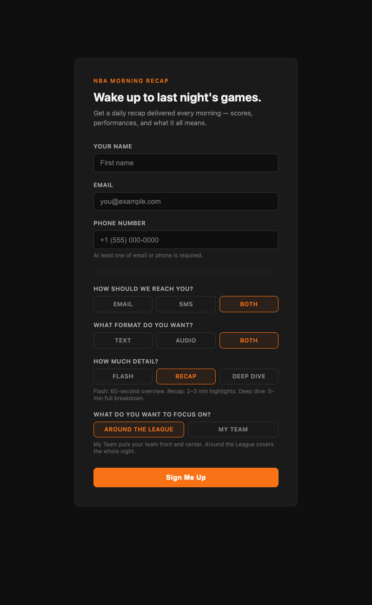

# NBA Morning Recap

AI-powered daily NBA recap delivered every morning via text, email, and audio — built with Claude, ElevenLabs, and the ESPN API.

You sign up once. Every morning at 8am you get a personalized recap of last night's games — the format, detail level, and focus are all yours to choose.

---

## What it does

The pipeline runs automatically every night:

1. **Fetches** last night's scores, box scores, and standings from the ESPN API
2. **Generates** a written or spoken recap using Claude (claude-sonnet-4-5)
3. **Converts** audio recaps to MP3 via ElevenLabs TTS
4. **Delivers** via SMS (Twilio), email (Resend), or both — based on user preference

---

## Signup form

Users sign up at the web app and choose exactly how they want their recap delivered.



**Preferences stored per user:**
- Delivery: Email / SMS / Both
- Format: Text / Audio / Both
- Detail level: Flash / Recap / Deep Dive
- Focus: Around the League / My Team (with full 30-team picker)

---

## Detail levels

### Flash — ~60 seconds
Every game, one sentence each. Scores, winner, one name. In and out.

> Good morning, hoops fans — here is everything that went down on Sunday night.
>
> Out in Oklahoma City, the Thunder stayed dominant, topping the Timberwolves one sixteen to one oh three, with Julius Randle dropping thirty two in a losing effort and Chet Holmgren anchoring the win for the best team in the West.
>
> And down in Cleveland, Dallas pulled off the road upset, beating the Cavaliers one thirty to one twenty, with rookie Cooper Flagg putting up twenty seven points and ten assists for the Mavericks.
>
> Up in Toronto, Brandon Ingram went off for thirty four points to lead the Raptors past Detroit one nineteen to one oh eight.
>
> Six games, six stories. Come back tonight for more. Let's go.

---

### Recap — 2–3 minutes
Claude editorially picks the 2–3 best games for full paragraphs, one-liner for the rest, standings snapshot to close.

> Good morning, hoops fans. Sunday night delivered wall-to-wall action across the league, and we've got a lot to unpack. Let's get into it.
>
> Start with Toronto, because Brandon Ingram put on a show. The Raptors handled Detroit 119-108, and Ingram was simply unguardable all night long — 34 points in a performance that looked effortless from start to finish. RJ Barrett added 27 to give Toronto two legitimate go-to scorers working in harmony. Cade Cunningham answered with 33 points and nine assists, keeping Detroit right in it deep into the fourth quarter before Toronto finally pulled away.
>
> Then there's Milwaukee, where Giannis Antetokounmpo reminded everyone what he's capable of when he's locked in. The Bucks rolled Indiana 134-123. Giannis went for 31 points, 14 rebounds, and 8 assists — nearly a triple-double — but the real surprise of the night was Bobby Portis, who went off for 29 points and 10 boards off the bench.
>
> And out west, Oklahoma City kept rolling. The Thunder dispatched Minnesota 116-103 to push their record to an absolutely absurd 53-15 — the best mark in the NBA, and it isn't particularly close.

---

### Deep Dive — 4–5 minutes
If your team played: full game story first, then the rest of the league. If they were off, opens with context and covers everything in depth.

> The Los Angeles Lakers were off last night — here's what happened around the league.
>
> Let's start in the East, where Toronto put on a show at home. Brandon Ingram was absolutely unconscious, dropping 34 points to lead the Raptors past the Detroit Pistons 119-108. RJ Barrett chipped in 27 of his own, and together those two made life miserable for a Detroit squad that still has the best record in the Eastern Conference at 48-19. Cade Cunningham fought hard with 33 points and 9 assists, but it wasn't enough.
>
> Over in Milwaukee, the Bucks put together one of the more impressive offensive nights of the week, blowing past Indiana 134-123. Giannis Antetokounmpo was a walking highlight reel — 31 points, 14 rebounds, 8 assists — and then Bobby Portis came off the bench and nearly matched him with 29 points and 10 boards.
>
> As for the Lakers — sitting at 42-25, they hold a comfortable position among the elite of the Western Conference. Oklahoma City and San Antonio are both ahead of them, but the Lakers are right there breathing down the Spurs' necks. Every game from here on out matters.

---

## Tech stack

| Layer | Tool |
|---|---|
| Runtime | Node.js + TypeScript |
| Server | Express |
| Scheduler | node-cron |
| Sports data | ESPN unofficial API (free, no key required) |
| AI | Anthropic Claude (claude-sonnet-4-5) |
| TTS | ElevenLabs (eleven_multilingual_v2) |
| SMS | Twilio |
| Email | Resend |
| Database | SQLite via better-sqlite3 |
| Hosting | Railway |

---

## Project structure

```
src/
  data/         # ESPN API fetching and data formatting
  ai/           # Claude prompt builder and recap generator
  audio/        # ElevenLabs TTS integration
  delivery/     # Twilio SMS + Resend email
  db/           # SQLite setup and queries
  server/       # Express routes and signup page
  scheduler/    # node-cron pipeline job
  scripts/      # Test scripts for each phase
  types/        # Shared TypeScript types
  utils/        # Logger, env validation
```

---

## Running locally

```bash
# Install dependencies
npm install

# Copy env file and fill in your keys
cp .env.example .env

# Test the data pipeline
npx ts-node src/scripts/test-data.ts

# Test AI recap generation
npx ts-node src/scripts/test-ai.ts

# Test audio generation
npx ts-node src/scripts/test-audio.ts

# Start the signup server
npx ts-node src/server/index.ts
```

---

## Environment variables

```
ANTHROPIC_API_KEY=
ELEVENLABS_API_KEY=
ELEVENLABS_VOICE_ID=
TWILIO_ACCOUNT_SID=
TWILIO_AUTH_TOKEN=
TWILIO_PHONE_NUMBER=
RESEND_API_KEY=
DATABASE_PATH=./data/users.db
```

---

## Build phases

- [x] Phase 1 — Data pipeline (ESPN API → clean JSON)
- [x] Phase 2 — AI recap generation (Claude)
- [x] Phase 3 — Audio generation (ElevenLabs TTS)
- [x] Phase 4 — User signup + database (SQLite + Express)
- [ ] Phase 5 — Delivery (Twilio + Resend)
- [ ] Phase 6 — Scheduler + deployment (Railway)
- [ ] Phase 7 — Polish
